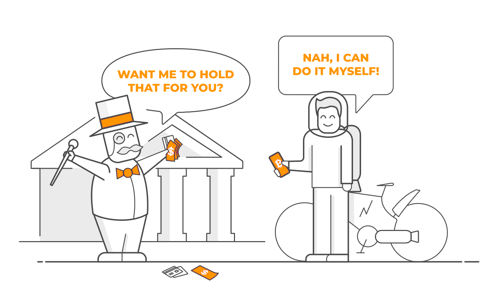
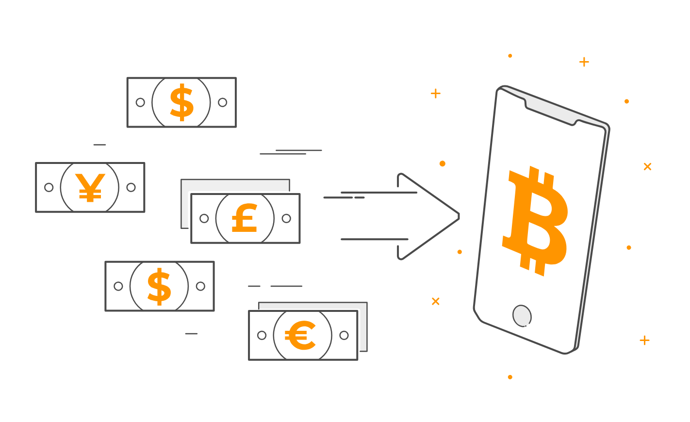
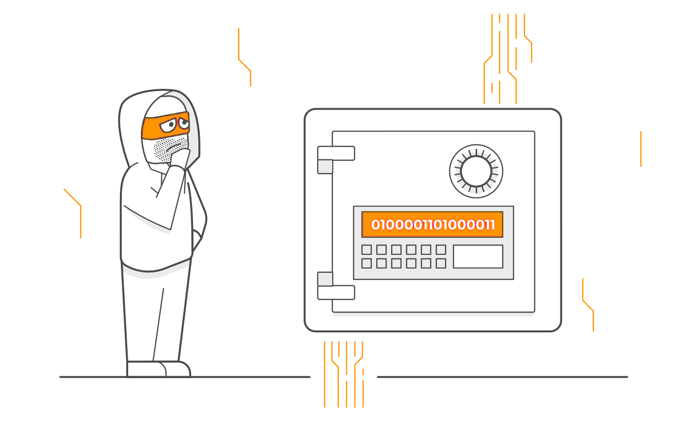
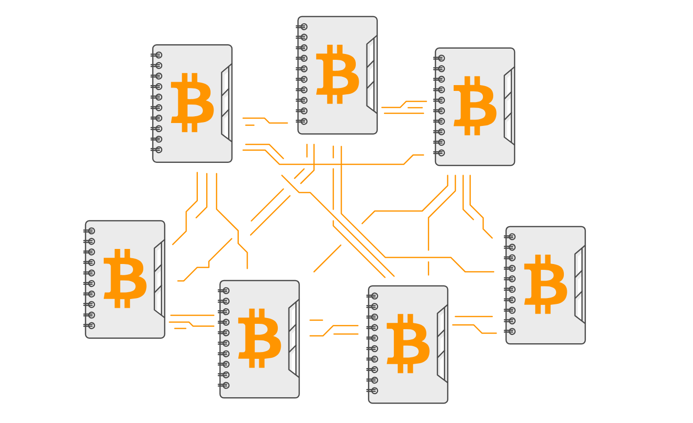
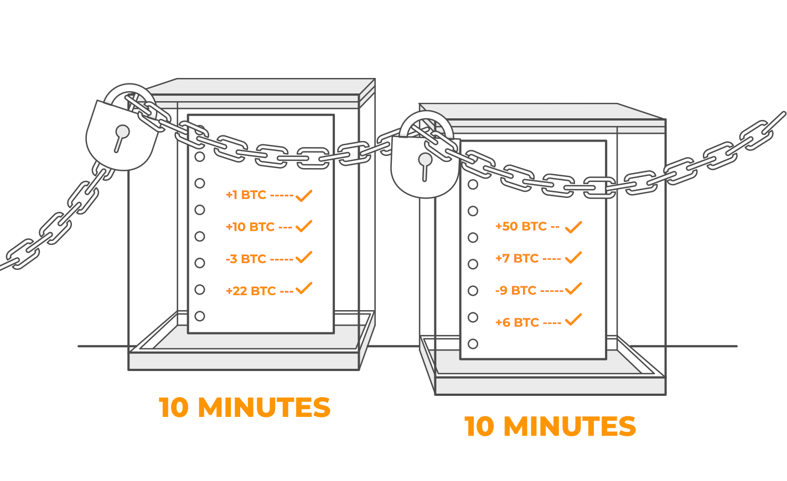

+++
title = 'Introduzione'
author = 'me'
date = 2024-10-05
weight = 1
draft = false
+++

> [!important] Brief:
> Questa sezione ti aiuterà a **capire** cos'è bitcoin, perché è stato sviluppato e a familiarizzare con le basi del suo funzionamento.

### Perchè è stato creato Bitcoin

Nell'agosto 2008 è stato registrato il dominio [bitcoin.org](https://bitcoin.org/en/) e a novembre, una persona misteriosa e tutt'oggi sconosciuta, ha pubblicato il famoso [Bitcoin Whitepaper](src/bitcoin_it.pdf), firmato da [Satoshi Nakamoto](https://it.wikipedia.org/wiki/Satoshi_Nakamoto). I primi bitcoin sono stati emessi nel gennaio 2009.
Bitcoin è progettato per consentirti di archiviare, inviare e ricevere denaro senza banche o società di intermediazione, risolvendo definitivamente il [problema della doppia spesa](https://it.wikipedia.org/wiki/Doppia_spesa) in modo diverso: rendendo pubblici tutti i conti e le transazioni, ma senza rivelare dettagli privati ​​come l'anagrafica. 
Risolvere il problema della doppia spesa permette di inviare bitcoin **direttamente** da una persona ad un'altra, senza utilizzare **nessun** soggetto terzo di intermediazione, consentendo transazioni più veloci, economiche e nel rispetto della privacy, poichè le informazioni personali non sono presenti.

### Perchè Bitcoin è così rivoluzionario

- Bitcoin è una forma di denaro completamente digitale.
- Può essere utilizzato da chiunque, in qualsiasi parte del mondo.
- È una valuta universale.
- Consente transazioni veloci ed economiche in tutto il mondo e 24 ore su 24.
- Non è controllato da nessuna persona, azienda o governo.
- Per utilizzarlo è sufficiente una connessione ad internet ed un telefono o computer.

**Bitcoin non è controllato da nessuna persona, azienda o governo**.
A differenza dei pagamenti tradizionali che passano attraverso le banche, i bitcoin vengono inviati direttamente da persona a persona e questo è noto come sistema *peer-to-peer (P2P)*. Significa che **non esiste un controllo centrale**.
Gli utenti Bitcoin si trovano in tutto il mondo e utilizzano Internet per inviare e ricevere pagamenti, **senza bisogno di conoscersi o addirittura di fidarsi** affinché il sistema funzioni.
*Satoshi Nakamoto* ha reinventato completamente il funzionamento del denaro.

##### Vantaggio 1 - Decentralizzazione

- Il denaro tradizionale è controllato da banche e governi, il che lo rende una valuta *centralizzata*.
- Bitcoin non è controllato o regolato da alcuna singola entità, il che lo rende una valuta *decentralizzata*.
- Non avere banche coinvolte significa che nessuno può rifiutare la tua richiesta, nessuno può chiudere il tuo conto e nessuno può addebitarti commissioni eccessive. **Le banche non sono più responsabili** e questo è ciò che rende il denaro decentralizzato così potente.

##### Vantaggio 2 - Niente denaro contraffatto

- Le valute cartacee, le carte di credito e gli assegni possono essere contraffatti.
- Bitcoin risolve il problema della doppia spesa, il che **rende impossibile la contraffazione**; inoltre, non dovrai pagare tariffe elevate per la protezione dalle frodi.

##### Vantaggio 3 - Fornitura limitata

- La moneta tradizionale viene creata dai governi in quantità illimitate, il che ne diminuisce il valore nel tempo.
- La fornitura di bitcoin è limitata a 21 milioni di *monete*. È progettato per essere scarso in modo che aumenti di valore nel tempo.

Un’offerta di moneta in costante aumento crea qualcosa chiamato *inflazione*. Ciò significa che il denaro che possiedi vale ogni giorno un po’ meno.
L’offerta limitata di Bitcoin crea l’effetto opposto, chiamato *deflazione*. Ciò significa che il valore di ciascun Bitcoin è progettato per aumentare nel tempo.

##### Vantaggio 4 - Divisibilità

- Il denaro tradizionale può essere speso solo per importi piccoli come un singolo centesimo (quindi fino a 2 cifre decimali).
- I bitcoin possono essere spesi in importi molto più piccoli, chiamati *Satoshi* (fino a 8 cifre decimali).

Il bitcoin è altamente divisibile perché il suo valore è destinato ad aumentare nel tempo (attraverso la deflazione). Questa divisibilità significa che puoi spendere porzioni molto piccole di un bitcoin.
Le *microtransazioni* sono qualcosa che il denaro tradizionale non può fare, perché i centesimi non sono abbastanza divisibili e quindi troppo grandi per acquisti molto piccoli.

##### Vantaggio 5 - Sicurezza

C’è molto valore immagazzinato in bitcoin, quindi deve essere molto sicuro. Bitcoin utilizza la _crittografia_ per inviare pagamenti in modo sicuro (ad oggi non è mai stato violato); ecco perché è chiamato *criptovaluta*.
In termini semplici, la crittografia è una tecnologia che salvaguarda le informazioni attraverso complesse funzioni matematiche per proteggere il tuo account e consentirti di inviare denaro in sicurezza.

### Come funziona Bitcoin

Immagina quattro sconosciuti seduti in una stanza, ciascuno con il proprio taccuino. Poiché sono estranei, non si conoscono nè si fidano l'uno dell'altro.

I quattro sconosciuti rappresentano la comunità di utenti di bitcoin.
I taccuini rappresentano quella che viene chiamata *blockchain*.
La *blockchain* memorizza in un registro pubblico ogni singola transazione bitcoin mai effettuata.
La *blockchain* non è cartacea ma digitale, è pubblica e mantiene costantemente sincronizzate tutte le copie del registro.

Uno sconosciuto dà un bitcoin a un altro sconosciuto. Ora, **ciascuno** dei quattro sconosciuti registra questa transazione; quindi confrontano tutti i loro taccuini per assicurarsi che corrispondano.

Quando viene inviato bitcoin, la transazione viene registrata su **ognuna** delle migliaia di copie della *blockchain* in tutto il mondo. Ogni copia è una registrazione identica di tutte le transazioni. La *blockchain* confronta costantemente tutte le copie del registro pubblico per assicurarsi che tutte abbiano transazioni corrispondenti.
Se tutti i taccuini corrispondono, va tutto bene e la transazione è approvata da tutti, altrimenti significa che lo sconosciuto con il taccuino che non corrisponde agli altri sta mentendo sulla transazione e verrà ignorato da tutti gli altri.
È impossibile per i truffatori manipolare il sistema, poiché la loro copia del registro pubblico non corrisponderebbe a ciò su cui tutti gli altri sono d'accordo.

Inoltre, la *blockchain* archivia permanentemente tutte le transazioni passate in modo che si sappia sempre dove si trova ogni singolo bitcoin; questa caratteristica è molto potente poiché dimostra la proprietà senza bisogno di coinvolgere una terza parte.

Questo metodo di confronto di tutti i *taccuini* è chiamato **algoritmo di consenso**; in altre parole è un accordo reciproco secondo cui la transazione non è una frode.

La *blockchain* è la tecnologia che rende bitcoin così prezioso, perché elimina la necessità che terze parti controllino le transazioni.
Grazie alla *blockchain*, perfetti sconosciuti possono scambiare denaro senza alcuna fiducia reciproca. Una volta che un bitcoin passa di mano, la transazione diventa automaticamente una voce permanente nel registro pubblico, quindi il denaro non può essere speso due volte.

### Come funzionano le transazioni

Proprio come i soldi veri, i bitcoin sono archiviati nei portafogli, ma i portafogli di bitcoin sono digitali.
Il portafoglio non contiene bitcoin, ma ne garantisce semplicemente l’accesso.
I tuoi bitcoin vengono registrati sulla *blockchain* e solo lì si trovano.

Ogni portafoglio Bitcoin ha un indirizzo pubblico, in modo da poter inviare denaro da e verso di esso.

L'indirizzo pubblico del portafoglio bitcoin è come un numero di conto bancario: viene utilizzato per assicurarsi che il denaro venga inviato al portafoglio giusto.
**Tutto ciò che serve per ricevere denaro è il proprio l'indirizzo pubblico**, che è composto da una stringa di numeri e lettere, senza alcun riferimento ai propri dati personali.

Per inviare bitcoin da un portafoglio all'altro, bisogna prima autorizzare la transazione tramite una firma, che viene siglata apponendo la chiave privata: funziona come l'inserimento di una password, ma in realtà è la tua firma digitale.

La firma digitale dimostra che sei stato tu ad autorizzare il trasferimento.
**È molto importante mantenere sempre segreta la chiave privata**.

---

### Esempio pratico

Supponiamo che Mattia voglia inviare ad Alice un bitcoin.
Per fare ciò, Mattia inserisce sul suo portafoglio l'indirizzo pubblico di Alice, quindi il suo portafoglio utilizza la chiave privata per firmare e quindi autorizzare la transazione. Ora il bitcoin è in arrivo.

Alice non deve fare nulla per ricevere il denaro e nessuna terza parte (come ad esempio una banca) deve elaborare la transazione o può interromperla.

Una volta che Mattia preme "Invia", la sua transazione bitcoin viene aggiunta alla blockchain per l'elaborazione.

La transazione bitcoin di Mattia non è stata ancora inviata; Mattia ha solo annunciato di voler inviare i suoi bitcoin. Successivamente, la comunità di utenti verifica che Mattia abbia effettivamente abbastanza bitcoin da inviare. Questa verifica viene eseguita automaticamente confrontando le copie blockchain e, una volta ultimata la verifica, il bitcoin di Mattia è in arrivo.

Ecco come funziona l'elaborazione: le transazioni degli ultimi 10 minuti vengono raggruppate insieme. Ciascuno di questi gruppi è chiamato blocco. Insieme, i blocchi formano la _blockchain_, da cui il nome.

Tutte le transazioni bitcoin vengono raggruppate e aggiunte ai blocchi in ordine. Ogni blocco bitcoin viene riempito con nuove transazioni finché non è pieno. Le transazioni in eccesso vengono aggiunte al blocco successivo.

I minatori raggruppano le transazioni, le verificano e le aggiungono alla _blockchain_. I minatori fanno questo lavoro perché, per ogni blocco che aggiungono e per ogni transazione che elaborano, ottengono come ricompensa bitcoin nuovi che sono stati appena creati dal sistema. Ecco come nascono i bitcoin!

Questo processo continuerà fino all’anno 2140, quando saranno stati creati tutti i 21 milioni di bitcoin; dopodiché non potrà mai essercene uno di più! Successivamente, i minatori continueranno a ricevere piccole commissioni di transazione, ma nessun nuovo bitcoin.

Bitcoin è rivoluzionario perché ti dà il pieno controllo sul tuo denaro.

È un sistema intelligente che consente a perfetti sconosciuti di inviare denaro direttamente tra loro in modo sicuro: non è richiesta alcuna fiducia e non sono necessarie nemmeno terze parti.

---

> [!important] Concetti appresi:
> - Bitcoin permette di archiviare, inviare e ricevere denaro senza banche o società di intermediazione
> - ...
> - ...
> - ...
> - Continua l'elenco in autonomia, su un tuo quaderno
> - Scrivi i punti in ordine logico
> - Se non sai essere sintetico, rileggi questa sezione
> - Se non sai cosa scrivere, rileggi questa sezione

Fonti:
- _[21ideas](https://21ideas.org/en/)_
- _[wikipedia](https://it.wikipedia.org/)_
- [bitcoin paper](https://bitcoin.org/files/bitcoin-paper/bitcoin_it.pdf)

