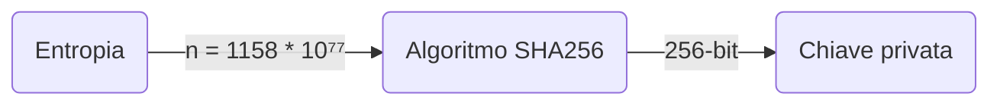

+++
title = 'Chiavi privata e pubblica'
author = 'me'
date = 2024-10-14
weight = 4
draft = false
+++

> [!important] Brief:
> Questa sezione ti aiuterà a capire cosa sono le chiavi private, le chiavi pubbliche, gli indirizzi e che relazioni ci sono tra loro.

> [!TIP]+ Con parole semplici
> ##### Immagina una cassetta delle lettere
> Per capire questi concetti, immagina di avere una cassetta delle lettere, in cui è presente una fessura di ingresso (chiave pubblica) ed una serratura (chiave privata).
> Ecco come funziona:
> - **Chiave pubblica**: è la chiave che puoi dare a chiunque, di modo che chiunque possa inserire dei bitocin nella tua cassetta, ma non può aprirla.
> - **Chiave privata**: è la chiave segreta che solo tu possiedi. Serve per aprire la cassetta e prendere i tuoi bitcoin. Se qualcun altro avesse questa chiave, potrebbe rubare tutto!
> ##### Come si creano le chiavi?
> - La **chiave privata** viene generata per prima. È come se tu creassi una password segreta super lunga e complessa. Questa chiave privata è unica e quasi impossibile da indovinare; è così importante che devi custodirla con estrema attenzione.
> - La **chiave pubblica** è creata a partire dalla chiave privata, grazie a una specie di "trucchetto matematico". Anche se chiunque può vedere la tua chiave pubblica, non può risalire alla tua chiave privata.
> ##### E gli indirizzi?
> Ora, immagina che qualcuno spii quante persone mettono qualcosa nella tua cassetta e veda quanti bitcoin ricevi. Per evitarlo, puoi fornire a ciascuno un indirizzo diverso, come se fossero punti di consegna sparsi ovunque, non riconducibili alla tua cassetta principale. Così, tutto ciò che ricevi sarà sempre tuo, ma nessuno potrà spiarti.
> ##### Non perdere la chiave privata!
> Un dettaglio fondamentale: se perdi la tua chiave privata, è come se avessi perso la chiave della tua cassetta per sempre e nessuno potrà più aprirla. Quindi, custodisci la chiave privata con cura, in un luogo sicuro, dove nessun altro può accedervi!

# Chiavi
### Chiave privata

La chiave privata è una sequenza di numeri e lettere che funge da password segreta per autorizzare le transazioni e quindi per spendere tuoi fondi. Chi possiede la chiave privata ha il pieno controllo sui bitcoin associati a quella chiave.

La generazione di una chiave privata utilizza il concetto di **entropia** (è il grado di casualità in un sistema) per creare una stringa di numeri completamente imprevedibile. Questo è fondamentale per garantire che ogni chiave sia unica e impossibile da indovinare o replicare.



Fonti comuni di entropia includono:
- **Generatori di numeri casuali**: I software di portafogli usano algoritmi avanzati per produrre numeri casuali, combinati e trasformati in una chiave privata.
- **Interazione dell'utente**: In alcuni casi, la casualità può essere aumentata dall'interazione dell'utente, ad esempio muovendo il mouse o lanciando dei dadi, per aggiungere ulteriore imprevedibilità.

La chiave privata di Bitcoin è un numero molto grande, compreso tra 1 e 2²⁵⁶ (circa 10⁷⁷). Questo intervallo garantisce che ci siano un'infinità di possibili chiavi private, rendendo praticamente impossibile generare per errore due chiavi uguali.

Per semplificare l'uso di queste chiavi, vengono spesso rappresentate in **formato esadecimale** (utilizzando cifre da 0 a 9 e lettere da A a F). Un esempio di chiave privata in formato esadecimale potrebbe essere:

```
5Kb8kLf9zgWQnogidDA76MzPL6TsZZY36hWXMssSzNydYXYB9KF
```

Poiché ricordare una stringa lunga di caratteri alfanumerici è difficile, la chiave privata viene convertita in una sequenza di 12 o 24 parole semplici da ricordare, chiamata **seed phrase** o frase seme. Questa frase viene generata attraverso lo standard [**BIP-39**](https://github.com/bitcoin/bips/blob/master/bip-0039/english.txt), che assegna una lista di parole predefinite a diversi segmenti della chiave privata. Ad esempio, una seed phrase potrebbe essere:
 
```
arena soldier album virus drift charge tree unveil follow poet lucky fashion
```

Questa serie di parole è un modo più umano e sicuro di gestire la chiave privata, poiché è più facile da memorizzare o annotare rispetto alla sequenza esadecimale. La frase seme può essere usata per ricostruire la chiave privata in qualsiasi portafoglio compatibile.

Alcuni portafogli offrono un ulteriore livello di sicurezza, consentendo di proteggere la frase seme con una **passphrase** aggiuntiva, creando un ulteriore strato di sicurezza. In questo modo, anche se la tua chiave venisse esposta, sarebbe inutilizzabile senza la passphrase corretta.

La chiave privata è il cuore del sistema Bitcoin, poiché consente l'accesso ai fondi e l'autorizzazione delle transazioni. Se qualcuno dovesse ottenerla, potrebbe trasferire i tuoi bitcoin senza il tuo consenso, e poiché non esistono meccanismi per recuperare i fondi rubati, la sicurezza dei tuoi bitcoin dipende interamente da quanto bene riesci a proteggere la tua chiave privata. Se la perdi, perdi anche l'accesso ai tuoi bitcoin, poiché non esiste un sistema centralizzato che possa ripristinarla. L'unico modo per recuperarla è tramite la _seed phrase_.


### Chiave pubblica

La chiave pubblica viene calcolata a partire dalla chiave privata utilizzando la *crittografia asimmetrica*, che rende irreversibile questa operazione.

Il proprietario della chiave privata può tranquillamente creare una chiave pubblica e condividerla con chiunque, sapendo che nessuno può invertire la funzione e risalire alla chiave privata.

In una transazione, la chiave pubblica del beneficiario identifica univocamente il destinatario, senza tuttavia rivelarne l'anagrafica.


---
#### 5. **Il ruolo della chiave pubblica**
Una volta generata la chiave privata, viene automaticamente creata anche una **chiave pubblica**, attraverso un processo crittografico chiamato **elliptic curve cryptography** (crittografia a curve ellittiche). La chiave pubblica è derivata dalla chiave privata e può essere condivisa con altri, poiché serve per ricevere i fondi. Tuttavia, la chiave privata deve rimanere segreta, poiché è l'unico modo per accedere ai fondi e autorizzare le transazioni.

---

# Indirizzi
### Indirizzi bitcoin

L'indirizzo viene calcolato a partire dalla chiave pubblica utilizzando la [*crittografia asimmetrica*](https://trama81.github.io/bitcoin/1_teoria_base/1_conoscere_bitcoin/3_crittografia/index.html), che rende irreversibile questa operazione.

L’indirizzo bitcoin è quello che appare comunemente in una transazione come il destinatario dei fondi. Nella pratica è però sconsigliato ricevere fondi sempre sullo stesso indirizzo, poichè questo introduce un problema di privacy: poichè la blockchain è pubblica, si può ricercare la chiave pubblica e trovare tutto lo storico delle transazioni, venendo a scoprire il saldo.

La soluzione a questo problema di privacy viene risolto sempre grazie alla crittografia, che a partire dalla stessa coppia di chiavi (privata e pubblica), è in grado di calcolare in modo deterministico una lista di indirizzi anonimi.


---

# 


### Come funziona la firma digitale?

Quando si effettua una transazione in Bitcoin, entra in gioco la **firma digitale**, che è un meccanismo crittografico utilizzato per garantire che il proprietario della chiave privata sia effettivamente colui che sta autorizzando la transazione. La firma digitale è una delle parti più importanti del sistema Bitcoin, perché consente di nascondere la chiave privata senza comprometterne la funzione.

Ecco come funziona il processo:
1. **Creazione della firma**: Quando invii bitcoin, il software del portafoglio utilizza la tua chiave privata per creare una firma digitale. Questa firma è un insieme di dati che conferma che tu possiedi la chiave privata senza mai rivelarla.
2. **Verifica della firma**: Una volta creata, la firma digitale viene verificata da altri nodi della rete Bitcoin utilizzando la tua **chiave pubblica**. Questi nodi possono confermare che la firma è stata creata da chi possiede la chiave privata associata alla chiave pubblica, senza che la chiave privata stessa venga esposta. In questo modo, la rete garantisce che solo il proprietario effettivo dei bitcoin possa spenderli, mantenendo al sicuro la chiave privata.
   
La firma digitale protegge quindi l'identità del mittente e garantisce che la transazione sia legittima, senza rivelare direttamente la chiave privata. Questo è uno degli aspetti fondamentali che permette a Bitcoin di funzionare in modo sicuro e decentralizzato.

### Perché la chiave privata è fondamentale?

La chiave privata è ciò che ti consente di spendere i tuoi bitcoin. Ogni volta che invii bitcoin a qualcun altro, la chiave privata viene utilizzata per creare la firma digitale, confermando che sei il legittimo proprietario dei fondi. Questo processo, pur essendo invisibile all'utente, è cruciale per mantenere la sicurezza della rete Bitcoin.

Questa versione integra la spiegazione sul funzionamento della firma digitale, chiarendo come la chiave privata rimane nascosta ma allo stesso tempo garantisce la legittimità delle transazioni.


### La chiave privata e la firma digitale: Come funzionano nel mondo di Bitcoin

Quando si parla di Bitcoin, uno dei concetti fondamentali da capire è il funzionamento della **chiave privata** e del meccanismo di **firma digitale**. Questi due elementi sono alla base della sicurezza e del controllo delle tue criptovalute. Sebbene il processo possa sembrare complesso, è possibile comprenderlo con un linguaggio semplice che ne chiarisca l’importanza e il funzionamento.

#### Il ruolo della chiave privata nelle transazioni Bitcoin

Ogni volta che invii bitcoin a qualcun altro, la tua chiave privata entra in gioco in modo invisibile ma essenziale. Vediamo come funziona il processo.

1. **Creazione della transazione**: Quando decidi di inviare bitcoin, il software del portafoglio genera una transazione che specifica la quantità di bitcoin da inviare e l’indirizzo del destinatario.
    
2. **Firma digitale**: Per autorizzare la transazione, la tua chiave privata viene utilizzata per creare una **firma digitale**. Questo è un processo crittografico che certifica che sei tu il legittimo proprietario dei fondi che stai inviando. La firma digitale agisce come una prova matematica che conferma l’autenticità della transazione senza rivelare la tua chiave privata.
    
3. **Invio della transazione**: Una volta firmata, la transazione viene trasmessa alla rete Bitcoin, dove sarà verificata dai nodi (computer che mantengono la rete). I nodi usano la tua **chiave pubblica** (che è collegata matematicamente alla tua chiave privata) per verificare la firma digitale e confermare che è stata creata da chi possiede effettivamente i fondi.
    
4. **Verifica della transazione**: La rete può verificare che la firma digitale sia corretta senza mai vedere la tua chiave privata. Questo sistema garantisce la sicurezza delle transazioni e il possesso dei fondi, senza compromettere la segretezza della chiave privata.
    

Una volta che la rete conferma la validità della firma, la transazione viene inclusa nel blocco successivo della blockchain, e i fondi vengono trasferiti al destinatario.

#### Firma digitale: Come protegge la tua chiave privata

La **firma digitale** è un elemento chiave della sicurezza in Bitcoin, poiché permette di **dimostrare il possesso** dei fondi senza mai rivelare la chiave privata stessa. Questo è possibile grazie alla **crittografia a chiave pubblica**, un sistema in cui la chiave privata e la chiave pubblica sono collegate, ma la chiave privata rimane nascosta.

Vediamo più nel dettaglio come funziona:

- Quando firmi una transazione con la tua chiave privata, il risultato è una firma unica che corrisponde solo a quella specifica transazione.
- La firma digitale può essere verificata da chiunque utilizzi la tua chiave pubblica, ma solo tu, con la chiave privata, puoi crearla.
- La firma certifica che la transazione è stata autorizzata dal proprietario dei fondi, ma non rivela alcuna informazione sulla chiave privata, proteggendo così la tua identità e sicurezza.

Questo sistema di firma digitale è il motivo per cui il Bitcoin è così sicuro: anche se la rete verifica le transazioni, nessuno può accedere ai fondi senza la chiave privata.

### Firma digitale: Come protegge la tua chiave privata

La **firma digitale** è un meccanismo crittografico che permette di autorizzare una transazione Bitcoin senza rivelare la tua chiave privata. Il processo di validazione di una transazione coinvolge vari passaggi, ciascuno con input e output specifici. Vediamo un esempio concreto. Supponiamo tu voglia inviare 1 bitcoin a un amico. Il primo passo è creare una transazione che include l'indirizzo del destinatario (l'**input**) e l'ammontare di bitcoin da trasferire. Questa transazione viene poi firmata utilizzando la tua chiave privata. Qui entra in gioco la **funzione hash**, che prende l'intera transazione come input e genera un valore crittografico univoco (l'**output**), una sorta di impronta digitale della transazione. A questo punto, utilizzi la tua chiave privata per creare la **firma digitale** di questo hash, che dimostra che la transazione è stata effettivamente autorizzata dal proprietario dei fondi. Quando invii la transazione firmata alla rete, i nodi Bitcoin prendono la tua **chiave pubblica** come input per verificare la firma. La rete non ha bisogno della tua chiave privata per effettuare questa verifica: usando la chiave pubblica e l’hash della transazione, i nodi possono confermare che la firma corrisponde ai fondi che possiedi senza rivelare la tua chiave privata. Solo se la firma è valida, la transazione viene accettata e inclusa nel prossimo blocco della blockchain. In questo modo, la firma digitale protegge la tua chiave privata garantendo comunque la sicurezza e l'integrità della transazione.