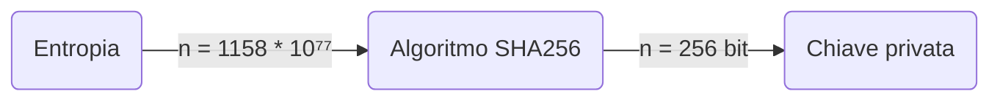
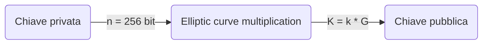

+++
title = 'Chiavi privata e pubblica'
author = 'me'
date = 2024-10-15
weight = 4
draft = true
+++

> [!important] Brief:
> Questa sezione ti aiuterà a capire cosa sono le chiavi private, le chiavi pubbliche, gli indirizzi e che relazioni ci sono tra loro.

> [!TIP]+ Con parole semplici
> ##### Immagina una cassetta delle lettere
> Per capire questi concetti, immagina di avere una cassetta delle lettere, in cui è presente una fessura di ingresso (chiave pubblica) ed una serratura (chiave privata).
> Ecco come funziona:
> - **Chiave pubblica**: è la chiave che puoi dare a chiunque, di modo che chiunque possa inserire dei bitocin nella tua cassetta, ma non può aprirla.
> - **Chiave privata**: è la chiave segreta che solo tu possiedi. Serve per aprire la cassetta e prendere i tuoi bitcoin. Se qualcun altro avesse questa chiave, potrebbe rubare tutto!
> ##### Come si creano le chiavi?
> - La **chiave privata** viene generata per prima. È come se tu creassi una password segreta super lunga e complessa. Questa chiave privata è unica e quasi impossibile da indovinare; è così importante che devi custodirla con estrema attenzione.
> - La **chiave pubblica** è creata a partire dalla chiave privata, grazie a una specie di "trucchetto matematico". Anche se chiunque può vedere la tua chiave pubblica, non può risalire alla tua chiave privata.
> ##### E gli indirizzi?
> Ora, immagina che qualcuno spii quante persone mettono qualcosa nella tua cassetta e veda quanti bitcoin ricevi. Per evitarlo, puoi fornire a ciascuno un indirizzo diverso, come se fossero punti di consegna sparsi ovunque, non riconducibili alla tua cassetta principale. Così, tutto ciò che ricevi sarà sempre tuo, ma nessuno potrà spiarti.
> ##### Non perdere la chiave privata!
> Un dettaglio fondamentale: se perdi la tua chiave privata, è come se avessi perso la chiave della tua cassetta per sempre e nessuno potrà più aprirla. Quindi, custodisci la chiave privata con cura, in un luogo sicuro, dove nessun altro può accedervi!

# Chiavi
### Chiave privata

La chiave privata è una sequenza di numeri e lettere che funge da password segreta per autorizzare le transazioni e quindi per spendere tuoi fondi. Chi possiede la chiave privata ha il pieno controllo sui bitcoin associati a quella chiave.

La generazione di una chiave privata utilizza il concetto di **entropia** (è il grado di casualità in un sistema) per creare una stringa di numeri completamente imprevedibile. Questo è fondamentale per garantire che ogni chiave sia unica e impossibile da indovinare o replicare.



Fonti comuni di entropia includono:
- **Generatori di numeri casuali**: I software di portafogli usano algoritmi avanzati per produrre numeri casuali, combinati e trasformati in una chiave privata.
- **Interazione dell'utente**: In alcuni casi, la casualità può essere aumentata dall'interazione dell'utente, ad esempio muovendo il mouse o lanciando dei dadi, per aggiungere ulteriore imprevedibilità.

La chiave privata di Bitcoin è un numero molto grande, compreso tra 1 e 2²⁵⁶ (circa 10⁷⁷). Questo intervallo garantisce che ci siano un'infinità di possibili chiavi private, rendendo praticamente impossibile generare per errore due chiavi uguali.

Per semplificare l'uso di queste chiavi, vengono spesso rappresentate in **formato esadecimale** (utilizzando cifre da 0 a 9 e lettere da A a F). Un esempio di chiave privata in formato esadecimale potrebbe essere:

```
5Kb8kLf9zgWQnogidDA76MzPL6TsZZY36hWXMssSzNydYXYB9KF
```

Poiché ricordare una stringa lunga di caratteri alfanumerici è difficile, la chiave privata viene convertita in una sequenza di 12 o 24 parole semplici da ricordare, chiamata **seed phrase** o frase seme. Questa frase viene generata attraverso lo standard [**BIP-39**](https://github.com/bitcoin/bips/blob/master/bip-0039/english.txt), che assegna una lista di parole predefinite a diversi segmenti della chiave privata. Ad esempio, una seed phrase potrebbe essere:
 
```
arena soldier album virus drift charge tree unveil follow poet lucky fashion
```

Questa serie di parole è un modo più umano e sicuro di gestire la chiave privata, poiché è più facile da memorizzare o annotare rispetto alla sequenza esadecimale. La frase seme può essere usata per ricostruire la chiave privata in qualsiasi portafoglio compatibile.

Alcuni portafogli offrono un ulteriore livello di sicurezza, consentendo di proteggere la frase seme con una **passphrase** aggiuntiva, creando un ulteriore strato di sicurezza. In questo modo, anche se la tua chiave venisse esposta, sarebbe inutilizzabile senza la passphrase corretta.

La chiave privata è il cuore del sistema Bitcoin, poiché consente l'accesso ai fondi e l'autorizzazione delle transazioni. Se qualcuno dovesse ottenerla, potrebbe trasferire i tuoi bitcoin senza il tuo consenso, e poiché non esistono meccanismi per recuperare i fondi rubati, la sicurezza dei tuoi bitcoin dipende interamente da quanto bene riesci a proteggere la tua chiave privata. Se la perdi, perdi anche l'accesso ai tuoi bitcoin, poiché non esiste un sistema centralizzato che possa ripristinarla. L'unico modo per recuperarla è tramite la _seed phrase_.

### Chiave pubblica

La **chiave pubblica** è un elemento essenziale per garantire la sicurezza e la trasparenza delle transazioni. Si tratta di una stringa alfanumerica generata dalla chiave privata, che consente di ricevere bitcoin e verificare le transazioni senza compromettere la sicurezza dei fondi.

Svolge due ruoli principali:
1) **Ricezione di fondi**: quando qualcuno vuole inviarti bitcoin, entra in gioco la tua chiave pubblica, che viene trasformata in un **indirizzo Bitcoin** da fornire al mittente per semplificare e rendere più sicuro l'invio dei fondi.
    
2) **Verifica delle transazioni**: permette di autenticare l'origine dei fondi e di garantire che solo il legittimo proprietario della chiave privata possa autorizzare il movimento dei bitcoin.

La chiave pubblica viene calcolata a partire dalla chiave privata utilizzando la *crittografia asimmetrica* (moltiplicazione delle curve ellittiche), che rende irreversibile questa operazione.


dove:
: k = chiave privata
: K = chiave pubblica risultante
: G = punto di generazione della curva ellittica

La chiave pubblica così generata identifica univocamente il beneficiario senza rivelarne l'anagrafica e può essere condivisa con chiunque, sapendo che nessuno può invertire la funzione e risalire alla chiave privata. Se però qualcuno riuscisse a collegare la tua chiave pubblica alla tua identità reale, potrebbe monitorare sulla blockchain tutte le tue transazioni e risalire al tuo saldo associato a quella chiave pubblica, violando la tua privacy. Per questo motivo, è doveroso adottare pratiche di sicurezza aggiuntive, come creare nuovi indirizzi bitcoin per ogni transazione.


---

# Indirizzi
### Indirizzi bitcoin

L'indirizzo viene calcolato a partire dalla chiave pubblica utilizzando la [*crittografia asimmetrica*](https://trama81.github.io/bitcoin/1_teoria_base/1_conoscere_bitcoin/3_crittografia/index.html), che rende irreversibile questa operazione.

L’indirizzo bitcoin è quello che appare comunemente in una transazione come il destinatario dei fondi. Nella pratica è però sconsigliato ricevere fondi sempre sullo stesso indirizzo, poichè questo introduce un problema di privacy: poichè la blockchain è pubblica, si può ricercare la chiave pubblica e trovare tutto lo storico delle transazioni, venendo a scoprire il saldo.

La soluzione a questo problema di privacy viene risolto sempre grazie alla crittografia, che a partire dalla stessa coppia di chiavi (privata e pubblica), è in grado di calcolare in modo deterministico una lista di indirizzi anonimi.
